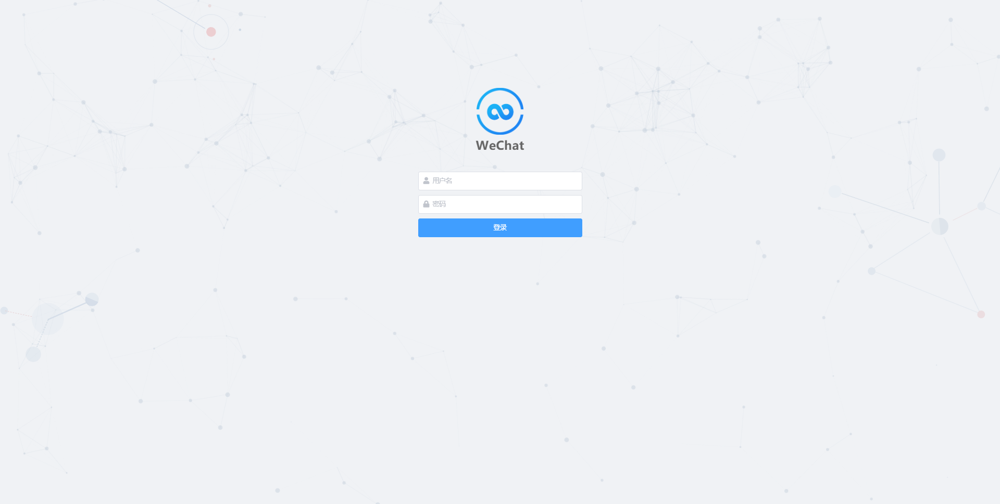
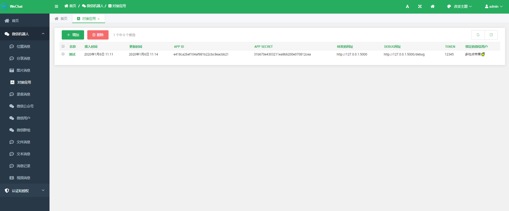
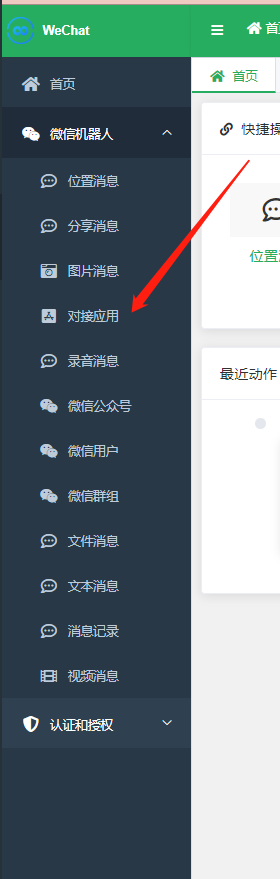
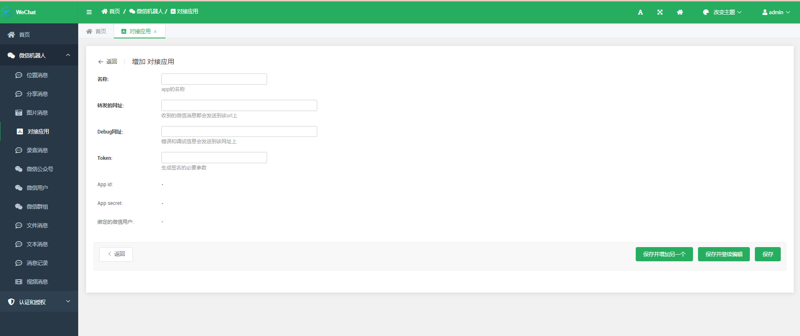

# WeChat微信转发服务

### 安装配置

*   请确保你的python的版本为python3.6及以上
*   clone项目
    ```shell
    git clone https://github.com/Ivy-1996/wechat.git
    ```
*	安装配置
		```shell
		mkvirtualenv  wechat
		cd conf
		pip install -r requirements.txt
		```
*	执行数据库迁移脚本
	```shell
	python manager.py migrate
	```

*	运行测试环境
	```shell
	python manager.py runserver
	```
*	创建管理员用户
	```shell
	python manager.py createsuperuser
	```

*	登录管理页面
	http://127.0.0.1:8000/admin
	

*   创建app
    
    
    
    

### 接口访问
*   登录
    *   `url`: `/login?app_id=<app_id>&app_secret=<app_secret>`
    *   由于微信的隐私策略,一个app只能绑定一个微信账号,第一次登录的用户默认绑定该app

*   生成签名
    *   由创建app时候设置的token和当前的时间戳经过sha1加密生成
    ```python
    import hashlib


    def create_signature(token:str, timestamp:str, reverse=False):
        data = [token, timestamp]
        data.sort(reverse=reverse)
        key = ''.join(data)
        return hashlib.sha1(key.encode()).hexdigest()
    ```
    
*   获取好友列表
    *   `url`: `/firends?app_id=<app_id>&app_secret=<app_secret>&timestamp=<timestamp>&signature=<signature>`
    *   返回格式:
        ```json
        
		{
			"count": 313,
			"next": "http://127.0.0.1:8000/friends?app_id=e418ca26ef104af981b22cbc8eacbb21&app_secret=31b670e4303211ea9b6200e070812cea&page=2",
			"previous": null,
			"results": [
			{
				"puid": "12ed2cd6",
				"insert_time": "2020-01-06T11:14:09.569667",
				"update_time": "2020-01-06T17:29:50.041745",
				"name": "多吃点苹果🍏",
				"nick_name": "多吃点苹果🍏",
				"user_name": "@b5062876e38c69d46e08bffc445933c79411023c8dcaf0a68d7d83a5b253c517",
				"remark_name": null,
				"avatar": "/media/image/avatar/12ed2cd6.jpg",
				"signature": null,
				"sex": null,
				"province": null,
				"city": null,
				"is_friend": true,
				"friend": true,
				"owner": "12ed2cd6"
			},
			......
			],
			"success": true
		}
        ```
	*
*	获取群组列表
	* 	`url`: `/groups?app_id=<app_id>&app_secret=<app_secret>&timestamp=<timestamp>&signature=<signature>`
	*	返回格式
		```json
  
        {
            "count": 13,
            "next": "http://127.0.0.1:8000/groups?app_id=e418ca26ef104af981b22cbc8eacbb21&app_secret=31b670e4303211ea9b6200e070812cea&page=2",
            "previous": null,
            "results": [
                    {
                        "puid": "973e46d8",
                        "member_count": 3,
                        "insert_time": "2020-01-06T15:21:20.837751",
                        "update_time": "2020-01-06T16:11:29.169215",
                        "name": "测试群1",
                        "nick_name": "测试群1",
                        "user_name": "@@9419e194b03ebddd6b62b7ebd9de397eb764c8e450c1552e4e9f8b27e7f066ec",
                        "avatar": "/media/image/avatar/973e46d8.jpg",
                        "owner": "12ed2cd6"
                    },
                    ......
            ],
            "success": true
        }

    ```

*	获取群员列表
	* `url`: `/members/<group_puid>?app_id=<app_id>&app_secret=<app_secret>&timestamp=<timestamp>&signature=<signature>`
	*  返回格式
	    ```json
          {
            "count": 4,
            "next": null,
            "previous": null,
            "results": [
                {
                    "puid": "c9c27d87",
                    "insert_time": "2020-01-07T10:20:31.179869",
                    "update_time": "2020-01-07T10:21:13.701743",
                    "name": "name",
                    "nick_name": "nick_name",
                    "user_name": "user_name",
                    "remark_name": "***",
                    "avatar": "/media/image/avatar/c9c27d87.jpg",
                    "signature": "想念从前的某些日子某些朋友\n时光总是在走，记忆似乎也已模糊了",
                    "sex": 1,
                    "province": "**",
                    "city": "**",
                    "is_friend": true,
                    "friend": true,
                    "owner": "e1d54615"
                },
                ......
            ],
            "success": true
        }
        ```
 
 *  主动发消息
    *   `url`: `/send?app_id=<app_id>&app_secret=<app_secret>&timestamp=<timestamp>&signature=<signature>`
    *   参数： 
    
        | 字段        | required |  type   | desc|
        | --------   | --------:| :----:  | :----:|
        | msg_type   |     是   |   string |   发送消息的类型(text, image, file, video)  |
        | puid       |     是   |   string |发送对象的puid|
        | group      |     否   |  Boolean  |发送对象是否为群组|
        | text       |     否   |  string  |发送的文本内容,当msg_type为text时,该参数必填 |
        | url        |     否   |  string  |发送媒体的url,当msg_type不为text时,该参数必填 |
    *   成功返回
        ```json
        {"msg_type": "text", "puid": "1fee435b", "text": "666", "success": true}
        ```

*   被动回复消息
    *   当接受到消息之后,消息会发送到创建app时配置的url上
    *   发送消息格式
    ```json
    {
      "id": 6050338562629220245,
      "insert_time": "2020-01-07T11:25:46.124013",
      "update_time": "2020-01-07T11:25:46.124013",
      "type": "Text", 
      "create_time": "2020-01-07T11:32:48",
      "receive_time": "2020-01-07T11:25:45.988020",
      "is_at": null, 
      "send_user": "1fee435b",
      "send_group": null,
      "maps": null,
      "receiver": "e1d54615",
      "receiver_group": null,
      "owner": "e1d54615",
      "content": {
          "id": 44,
          "insert_time": "2020-01-07T11:25:46.149010",
          "update_time": "2020-01-07T11:25:46.149010", 
          "text": "测试",
          "message": 6050338562629220245
          }
      }
    ```
    *   回复参数
    
        | 字段        | required |  type   | desc|
        | --------   | --------:| :----:  | :----:|
        | msg_type   |     是   |   string |   发送消息的类型(text, image, file, video)  |
        | text       |     否   |  string  |发送的文本内容,当msg_type为text时,该参数必填 |
        | url        |     否   |  string  |发送媒体的url,当msg_type不为text时,该参数必填 |

*   查询聊天记录
    *   `url`: `/message?app_id=<app_id>&app_secret=<app_secret>&timestamp=<timestamp>&signature=<signature>`
    *   不加条件筛选默认返回所有当前app绑定用户的所有聊天记录
    *   支持删选的条件
        ```python
        filterset_fields = ('type', 'create_time', 'receive_time', 'send_user', 'send_group', 'maps', 'receiver', 'receiver_group')
        ```
        如: `/message?app_id=<app_id>&app_secret=<app_secret>&send_user=1fee435b`
    *   返回格式
        ```json
        {
            "count": 1,
            "next": null,
            "previous": null,
            "results": [
                {
                    "id": 6050338562629220245,
                    "content": {
                        "id": 44,
                        "insert_time": "2020-01-07T11:25:46.149010",
                        "update_time": "2020-01-07T11:25:46.149010",
                        "text": "测试",
                        "message": 6050338562629220245
                    },
                    "insert_time": "2020-01-07T11:25:46.124013",
                    "update_time": "2020-01-07T11:25:46.124013",
                    "type": "Text",
                    "create_time": "2020-01-07 11:32:48",
                    "receive_time": "2020-01-07 11:25:45",
                    "is_at": null,
                    "send_user": "1fee435b",
                    "send_group": null,
                    "maps": null,
                    "receiver": "e1d54615",
                    "receiver_group": null,
                    "owner": "e1d54615"
                }
            ],
            "success": true
        }
        ```